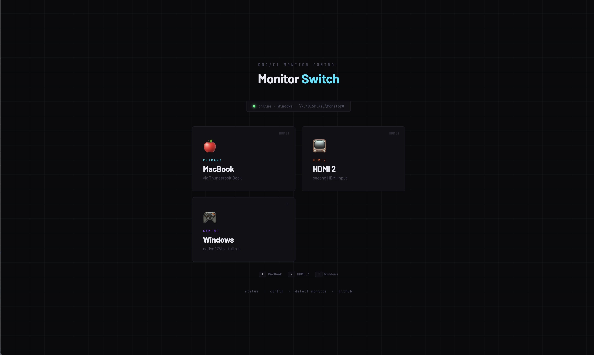

# MonitorSwitcher

A lightweight, self-contained web server that lets you switch your monitor's input source via DDC/CI — from any browser on your local network.

No cloud, no accounts, no bloat. One Python file, one `config.json`.



---

## Features

- **Web UI** — open from any device on your LAN (phone, tablet, another computer)
- **Cross-platform** — Windows, macOS (Apple Silicon + Intel), Linux
- **Auto-detects monitor by hardware ID** — immune to display number changes on reboot
- **Fully configurable** via `config.json` — labels, icons, inputs, port
- **Keyboard shortcuts** — auto-assigned (`1`, `2`, `3`...)
- **Zero Python dependencies** — uses only the standard library

---

## Requirements

### Python 3.8+

| Platform | How to get it |
|---|---|
| Windows | [python.org](https://python.org) — tick **"Add to PATH"** during install. Or Microsoft Store. |
| macOS | `brew install python` or use built-in `python3` |
| Linux | `sudo apt install python3` |

### DDC/CI backend

One external tool is required depending on your OS:

| OS | Tool | Install |
|---|---|---|
| Windows | [ControlMyMonitor](https://www.nirsoft.net/utils/control_my_monitor.html) | Download the 64-bit zip, extract `ControlMyMonitor.exe` into the project folder |
| macOS (Apple Silicon) | [m1ddc](https://github.com/waydabber/m1ddc) | `brew install m1ddc` |
| macOS (Intel) | [ddcctl](https://github.com/kfix/ddcctl) | `brew install ddcctl` |
| Linux | [ddcutil](https://www.ddcutil.com/) | `sudo apt install ddcutil` — then `sudo usermod -aG i2c $USER` and re-login |

### Monitor

Must support **DDC/CI**. Enable it in your monitor OSD (usually under *Extra*, *Setup*, or *System*). Most monitors made after ~2005 support it.

---

## Quick start

```bash
git clone https://github.com/yourusername/monitorswitcher.git
cd monitorswitcher
cp config.example.json config.json
# edit config.json — see "Configuration" below
```

**Windows:**
```
start.bat
```

**macOS / Linux:**
```bash
chmod +x start.sh
./start.sh
```

Open `http://localhost:5757` — or share the network URL shown in the console with other devices on your LAN.

---

## Configuration

Copy `config.example.json` to `config.json` and edit it:

```json
{
  "port": 5757,
  "monitor_id": "AOCA612",
  "inputs": {
    "hdmi1": {
      "label": "MacBook",
      "subtitle": "via Thunderbolt Dock",
      "icon": "🍎",
      "tag": "Primary",
      "vcp_value": 17
    },
    "dp": {
      "label": "Windows",
      "subtitle": "native 175Hz",
      "icon": "🎮",
      "tag": "Gaming",
      "vcp_value": 15
    }
  }
}
```

| Field | Description |
|---|---|
| `port` | HTTP port to listen on (1024–65535, default 5757) |
| `monitor_id` | Short hardware ID of your monitor — found via probe (see below) |
| `inputs` | One entry per input source you want buttons for |
| `inputs.*.vcp_value` | DDC/CI VCP 0x60 value for that input — found via probe |

Add or remove inputs freely. The UI generates buttons automatically. Up to 5 inputs have distinct colors; more cycle through.

### Finding your monitor_id and vcp_value

**Windows** — run `probe.bat`. It lists all monitors with their Short Monitor ID and current input VCP value:

```
Short Monitor ID: "AOCA612"
```

To find each input's value: manually switch to each input via the OSD, then run `probe.bat` again and note the VCP 60 value. Common values:

| Input | Typical vcp_value |
|---|---|
| DisplayPort | 15 |
| HDMI 1 | 17 |
| HDMI 2 | 18 |
| USB-C / Thunderbolt | varies |

**macOS:**
```bash
m1ddc display list          # Apple Silicon
ddcctl -d 0 -i ?            # Intel
```

**Linux:**
```bash
ddcutil detect
ddcutil getvcp 60           # read current input
```

---

## Auto-start

### Windows — Startup folder (recommended)

1. Press `Win+R` → type `shell:startup` → Enter
2. Create a file `monitorswitcher.vbs` in that folder:

```vbs
Set WshShell = CreateObject("WScript.Shell")
WshShell.CurrentDirectory = "C:\path\to\monitorswitcher"
WshShell.Run "pythonw.exe server.py", 0, False
```

Replace the path. `pythonw.exe` runs silently with no console window.

> **Note:** Task Scheduler with Microsoft Store Python may fail with "system cannot access file". The Startup folder method is more reliable.

### macOS — launchd

Create `~/Library/LaunchAgents/com.monitorswitcher.plist`:

```xml
<?xml version="1.0" encoding="UTF-8"?>
<!DOCTYPE plist PUBLIC "-//Apple//DTD PLIST 1.0//EN"
  "http://www.apple.com/DTDs/PropertyList-1.0.dtd">
<plist version="1.0">
<dict>
  <key>Label</key><string>com.monitorswitcher</string>
  <key>ProgramArguments</key>
  <array>
    <string>/usr/bin/python3</string>
    <string>/path/to/monitorswitcher/server.py</string>
  </array>
  <key>WorkingDirectory</key>
  <string>/path/to/monitorswitcher</string>
  <key>RunAtLoad</key><true/>
  <key>KeepAlive</key><true/>
</dict>
</plist>
```

```bash
launchctl load ~/Library/LaunchAgents/com.monitorswitcher.plist
```

### Linux — systemd user service

Create `~/.config/systemd/user/monitorswitcher.service`:

```ini
[Unit]
Description=MonitorSwitcher

[Service]
ExecStart=/usr/bin/python3 /path/to/monitorswitcher/server.py
WorkingDirectory=/path/to/monitorswitcher
Restart=on-failure
RestartSec=5

[Install]
WantedBy=default.target
```

```bash
systemctl --user enable monitorswitcher
systemctl --user start monitorswitcher
```

---

## API

The server exposes a simple REST API:

| Endpoint | Method | Description |
|---|---|---|
| `/` | GET | Web UI |
| `/status` | GET | Current VCP input value + OS + monitor handle |
| `/config` | GET | Active config (inputs, monitor_id, OS) |
| `/detect` | GET | Force re-detect monitor, return handle |
| `/switch/{key}` | POST | Switch to input by key (e.g. `/switch/dp`) |

---

## Security

MonitorSwitcher is designed for **trusted local networks only**. It:

- Binds to `0.0.0.0` — accessible to all devices on your LAN (shown as a warning on startup)
- Has no authentication
- Sanitizes input key names (alphanumeric + `_-` only, max 32 chars)
- Limits POST body reads to 8KB
- Strips query strings before route matching

**Do not expose it to the internet or untrusted networks.**

---

## Troubleshooting

**Switching doesn't work after reboot**
Display numbers can change. MonitorSwitcher auto-detects by hardware ID — open `/detect` in your browser to force a re-scan.

**"Monitor not found"**
- Check `monitor_id` in `config.json` exactly matches your probe output
- Verify DDC/CI is enabled in the monitor OSD
- Linux: check your user is in the `i2c` group — `groups $USER`

**Server starts but UI doesn't load**
- Make sure `index.html` is in the same folder as `server.py`
- Check the console for errors

**Windows: "system cannot access file" in Task Scheduler**
Use the Startup folder `.vbs` method instead — Task Scheduler has restrictions with Microsoft Store Python paths.

**macOS: no DDC tool found**
Install `m1ddc` (Apple Silicon) or `ddcctl` (Intel) via Homebrew.

**Linux: permission denied on DDC**
Run `sudo usermod -aG i2c $USER` and re-login. Or run with `sudo` temporarily to verify DDC works.

---

## Project structure

```
monitorswitcher/
├── server.py            ← HTTP server + cross-platform DDC logic
├── index.html           ← Web UI (buttons generated from config)
├── config.json          ← Your config (gitignored — copy from example)
├── config.example.json  ← Template for new users
├── start.bat            ← Windows launcher
├── start.sh             ← macOS/Linux launcher
├── probe.bat            ← Windows: find monitor ID and VCP values
├── .gitignore
├── LICENSE              ← MIT
└── README.md
```

---

## Contributing

PRs welcome. Particularly useful:
- Testing on more monitors and reporting working `vcp_value` mappings
- macOS multi-monitor detection improvements
- Linux display matching edge cases

---

## License

MIT — see [LICENSE](LICENSE)
